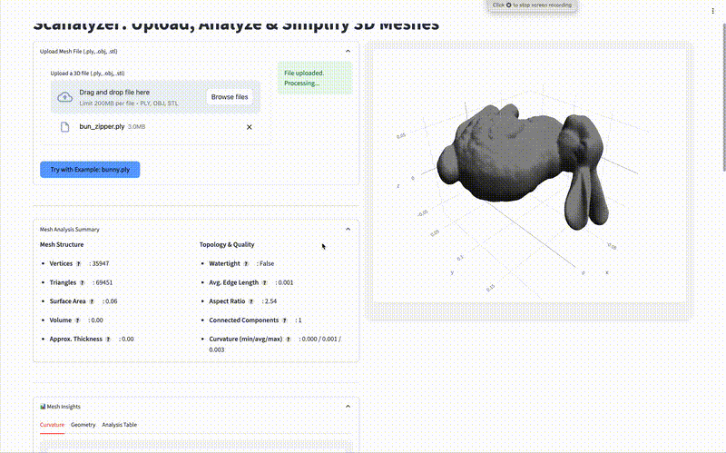

# Scanalyzer

**Scanalyzer** is a Streamlit-based web tool for 3D mesh inspection, simplification, and analysis. It enables users to upload or test with example meshes and gain insights into geometry features, curvature, thickness, and more — with integrated machine learning predictions.



---

## Features

- 🔍 **3D Viewer** for interactive mesh inspection  
- 📊 **Geometry Analysis**: surface area, volume, edge lengths, triangle quality  
- 🌈 **Curvature & Thickness Estimation**  
- 🧠 **ML-powered Simplification Suggestions**  
- 🧹 **Low-poly mesh generation** (Mild, Medium, Aggressive)  
- 🧪 **Example mesh support** for instant demo (.ply format)  

---

## Quickstart

```bash
# Clone the repo
git clone https://github.com/josepeon/scanalyzer.git
cd scanalyzer

# Create virtual environment
python3 -m venv venv
source venv/bin/activate

# Install dependencies
pip install -r requirements.txt

# Launch the app
streamlit run streamlit_app.py
```

---

## Folder Structure

```
scanalyzer/
├── analyzers/            # Mesh analysis logic
├── data/                 # Collected logs and model files
├── examples/             # Sample mesh files (e.g., bunny.ply)
├── model/                # Trained ML models
├── notebooks/            # Jupyter notebooks for ML training
├── utils/                # Utility functions (e.g., file loading)
├── streamlit_app.py      # Main app file
└── README.md
```

---

## ML Pipeline

- Trains a classifier (e.g. Random Forest) using logged mesh features  
- Predicts best simplification level  
- Model retrainable via `notebooks/train_model.ipynb`  
- Uses `data/simplification_logs.csv` for data logging

---

## Built With

- Streamlit  
- Trimesh  
- Open3D  
- scikit-learn  
- XGBoost

---

[](https://scanalyzer.onrender.com)

## License

This project is licensed for personal and educational use only. Contact the author for other usage scenarios.

## Credits

Built by [Jose Peon](https://github.com/josepeon)  
© 2025 — All rights reserved.