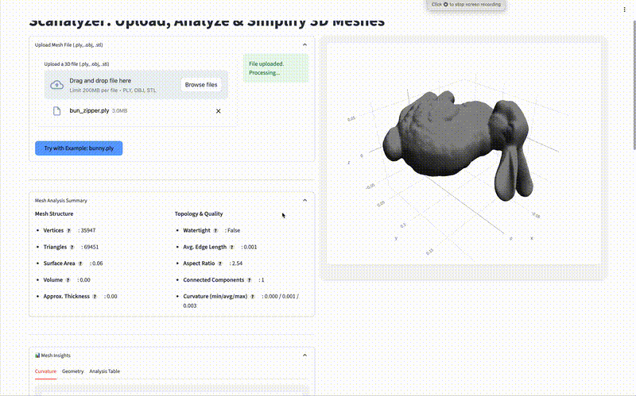

# Scanalyzer

Scanalyzer is a web-based tool for 3D mesh inspection, simplification, and analysis. Upload meshes to analyze geometry features, curvature, thickness, and receive ML-powered simplification recommendations.



---

## Features

- Interactive 3D mesh viewer
- Geometry analysis: surface area, volume, edge lengths, triangle quality
- Curvature and thickness estimation
- ML-powered simplification level suggestions
- Mesh decimation with Mild, Medium, and Aggressive options
- Example meshes for quick testing

---

## Quickstart

```bash
# Clone the repository
git clone https://github.com/josepeon/scanalyzer.git
cd scanalyzer

# Create and activate virtual environment
python3 -m venv venv
source venv/bin/activate

# Install dependencies
pip install -r requirements.txt

# Launch the app
streamlit run streamlit_app.py
```

---

## Project Structure

```
scanalyzer/
├── app.py                 # Command-line interface
├── streamlit_app.py       # Web application (Streamlit)
├── requirements.txt       # Python dependencies
├── scanalyzer/            # Core library
│   ├── __init__.py
│   ├── analyzer.py        # Mesh analysis functions
│   └── loader.py          # 3D model loading
├── model/
│   └── simplification_model.pkl
├── data/
│   └── simplification_logs.csv
├── notebooks/
│   └── train_model.ipynb  # ML model training
├── examples/
│   ├── bunny.ply
│   └── armadillo.ply
└── assets/
    └── demo.gif
```

---

## ML Pipeline

The simplification suggester uses an XGBoost classifier trained on mesh features. To retrain:

1. Run simplifications through the web app to generate training data in `data/simplification_logs.csv`
2. Open `notebooks/train_model.ipynb`
3. Run all cells to train and export a new model

---

## Tech Stack

- Streamlit - Web interface
- Open3D - Mesh processing
- Trimesh - Mesh export and utilities
- XGBoost / scikit-learn - ML predictions
- Plotly - 3D visualization

---

## License

This project is licensed for personal and educational use only. Contact the author for other usage scenarios.

---

Built by Jose Peon
https://github.com/josepeon